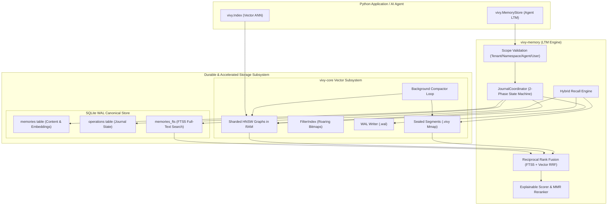

# Vivy: Comprehensive Integration Guide

Vivy is a local, durable long-term memory (LTM) runtime and single-machine vector engine engineered specifically for autonomous AI agents and local LLM applications. It provides zero-network, daemonless, crash-safe memory persistence combined with fast approximate nearest neighbor (ANN) vector retrieval.

This document serves as the authoritative, production-grade guide for integrating, operating, and managing Vivy, with primary focus on Python code integration (`vivy-py`).

---

## Table of Contents

1. [Architectural Overview & Core Invariants](#1-architectural-overview--core-invariants)
   - [Core Design Guarantees](#core-design-guarantees)
   - [Workspace Package Layout](#workspace-package-layout)
   - [System Dataflow & Layering](#system-dataflow--layering)
2. [Python Complete Code Guide (`vivy`)](#2-python-complete-code-guide-vivy)
   - [Installation & Build Setup](#installation--build-setup)
   - [High-Level Agent Memory (`vivy.MemoryStore`)](#high-level-agent-memory-vivymemorystore)
     - [1. Initializing & Opening a Store (`open`)](#1-initializing--opening-a-store-open)
     - [2. Storing Observations & Knowledge (`remember`)](#2-storing-observations--knowledge-remember)
     - [3. Memory Kinds & Semantic Categorization](#3-memory-kinds--semantic-categorization)
     - [4. Hybrid Candidate Recall & Reranking (`recall`)](#4-hybrid-candidate-recall--reranking-recall)
     - [5. Soft-Deleting Memories (`forget`)](#5-soft-deleting-memories-forget)
     - [6. Store Health Diagnostics (`health`)](#6-store-health-diagnostics-health)
     - [7. Resumable Physical Vacuuming (`vacuum_tombstones`)](#7-resumable-physical-vacuuming-vacuum_tombstones)
     - [8. Index Accelerator Rebuilding (`rebuild_index`)](#8-index-accelerator-rebuilding-rebuild_index)
   - [Low-Level Vector Search Index (`vivy.Index`)](#low-level-vector-search-index-vivyindex)
     - [1. Index Construction & Metric Options](#1-index-construction--metric-options)
     - [2. Vector Ingestion (`insert`, `insert_batch`)](#2-vector-ingestion-insert-insert_batch)
     - [3. Metadata Filter Queries (`search`)](#3-metadata-filter-queries-search)
     - [4. Multithreading & GIL Release Characteristics](#4-multithreading--gil-release-characteristics)
3. [Python Production Agent Workflows & Patterns](#3-python-production-agent-workflows--patterns)
   - [Pattern A: RAG Context Retrieval Agent](#pattern-a-rag-context-retrieval-agent)
   - [Pattern B: Multi-Tenant Preference-Aware User Chat Agent](#pattern-b-multi-tenant-preference-aware-user-chat-agent)
   - [Pattern C: Episodic Memory Buffer with Expiration](#pattern-c-episodic-memory-buffer-with-expiration)
   - [Pattern D: High-Throughput Batch Ingestion Pipeline](#pattern-d-high-throughput-batch-ingestion-pipeline)
   - [Pattern E: Background Maintenance Worker (Health & Vacuum)](#pattern-e-background-maintenance-worker-health--vacuum)
4. [Rust Core Reference (`vivy-memory` & `vivy-core`)](#4-rust-core-reference-vivy-memory--vivy-core)
   - [Rust Crate Architecture](#rust-crate-architecture)
   - [Rust MemoryStore Reference](#rust-memorystore-reference)
   - [Rust VivyIndex Vector Reference](#rust-vivyindex-vector-reference)
5. [Storage Schemas, Binary Formats & Data Models](#5-storage-schemas-binary-formats--data-models)
   - [SQLite Canonical Schema (`memories`, `operations`, `memories_fts`)](#sqlite-canonical-schema-memories-operations-memories_fts)
   - [Sealed Segment File Format (`.vivy`)](#sealed-segment-file-format-vivy)
   - [Write-Ahead Log Protocol (`.wal`)](#write-ahead-log-protocol-wal)
   - [Directory Manifest Protocol (`manifest.idx`)](#directory-manifest-protocol-manifestidx)
6. [Operational Maintenance & Recovery](#6-operational-maintenance--recovery)
   - [Startup Crash Recovery & Reconcile Protocol](#startup-crash-recovery--reconcile-protocol)
   - [Telemetry & Security Invariants](#telemetry--security-invariants)
7. [Benchmarking & Verification Guide](#7-benchmarking--verification-guide)
   - [Running the Workspace Test Suite](#running-the-workspace-test-suite)
   - [Synthetic Benchmarks (`sim`)](#synthetic-benchmarks-sim)
   - [Performance Matrix Reference](#performance-matrix-reference)
8. [Licensing & Commercial Terms (BSL-1.1)](#8-licensing--commercial-terms-bsl-11)
   - [Business Source License 1.1 Summary](#business-source-license-11-summary)
   - [Additional Use Grant Parameters](#additional-use-grant-parameters)

---

## 1. Architectural Overview & Core Invariants

### Core Design Guarantees

Vivy is built on three fundamental architectural guarantees:

1. **Durability First (SQLite WAL Primary Truth)**: SQLite with Write-Ahead Logging (`PRAGMA journal_mode=WAL`) serves as the authoritative, crash-safe canonical data store. Every memory record, revision, provenance attribute, and journal entry is committed to SQLite.
2. **Index as Derived State**: The `vivy-core` HNSW vector graph is strictly treated as an in-memory, auto-rebuildable acceleration index. If the process crashes or vector memory is corrupted, the index is re-populated directly from active SQLite records on boot without data loss.
3. **Strict Multi-Tenant Isolation**: Partitioning across tenants, namespaces, agents, and users (`MemoryScope`) is validated at API entry and strictly enforced through parameterized SQL queries and retrieval post-filters. Zero cross-tenant data leakage is allowed under any operation.

---

### Workspace Package Layout

Vivy is organized into four specialized packages:

| Package | Path | Responsibility |
| :--- | :--- | :--- |
| **`vivy-py`** | `py/` | Native Python extension module providing high-level `vivy.MemoryStore` and low-level `vivy.Index` classes with GIL release. |
| **`vivy-memory`** | `ltm/` | High-level durable LTM runtime: multi-tenant isolation, SQLite WAL canonical store, 2-phase operation journal, hybrid recall (FTS5 + HNSW vector RRF), explainable 4-factor scoring, and MMR diversity reranking. |
| **`vivy-core`** | `vec/` | High-throughput in-process vector engine: sharded HNSW graphs, Roaring bitmap metadata filters, 64-bit ID safety, atomic sealed segments (`.vivy`), WAL, and auto-compactor. |
| **`bench`** | `sim/` | Synthetic data benchmark suite for measuring QPS, latency, startup recovery, and ground-truth recall accuracy. |

---

### System Dataflow & Layering



---

## 2. Python Complete Code Guide (`vivy`)

### Installation & Build Setup

`vivy` Python bindings are built using [PyO3](https://pyo3.rs) and [maturin](https://github.com/PyO3/maturin).

#### Building locally with Maturin:
```bash
# Navigate to the Python crate directory
cd py

# Create and activate a virtual environment
python3 -m venv .venv
source .venv/bin/activate

# Install maturin and build in release mode
pip install maturin
maturin develop --release
```

Once built, `import vivy` is ready for use in any Python application.

---

### High-Level Agent Memory (`vivy.MemoryStore`)

`vivy.MemoryStore` is the primary interface for managing durable long-term memory for AI agents.

#### 1. Initializing & Opening a Store (`open`)

```python
import vivy

# Open or create a local durable memory store
store = vivy.MemoryStore.open(
    path="./agent_memory_data",
    dimensions=1536,
    embedding_model="text-embedding-3-small",
    max_recall_limit=100  # Optional, default: 100
)
```

##### Parameters:
- `path` (`str`): Directory path for storing `memory.db` and vector index files.
- `dimensions` (`int`): Exact dimension of vector embeddings (e.g., `1536`, `768`, `384`).
- `embedding_model` (`str`): Model name identifier used for embedding consistency checks.
- `max_recall_limit` (`int`, optional): Upper limit on candidate items returned by recall. Default is `100`.

---

#### 2. Storing Observations & Knowledge (`remember`)

Store an observation, fact, or instruction into durable memory.

```python
memory_id = store.remember(
    tenant_id="acme_corp",
    namespace="support_chat",
    content="User prefers Python over JavaScript for backend examples.",
    embedding=[0.012, -0.045, 0.089] + [0.0] * 1533,  # Dimension must match 1536
    kind="preference",                               # Category: preference, fact, instruction, context, episodic
    importance=0.9,                                  # float from 0.0 to 1.0
    agent_id="agent_assistant_v2",                   # Optional agent partition
    user_id="user_98234",                            # Optional user partition
    operation_id="op_rem_unique_001",                # Optional UUID for idempotent retry
    expires_at_ms=1767225600000                      # Optional expiry (epoch ms)
)

print(f"Memory recorded successfully with ID: {memory_id}")
```

##### Parameters:
- `tenant_id` (`str`): Tenant identifier (non-empty).
- `namespace` (`str`): Logical namespace partition (non-empty).
- `content` (`str`): Raw text content of the memory.
- `embedding` (`List[float]`): Vector embedding matching store dimensions.
- `kind` (`str`, optional): Semantic category (`"preference"`, `"fact"`, `"instruction"`, `"context"`, `"episodic"`). Default: `"fact"`.
- `importance` (`float`, optional): Subjective weight from `0.0` (trivial) to `1.0` (critical). Default: `0.5`.
- `agent_id` (`str`, optional): Specific agent identifier.
- `user_id` (`str`, optional): Specific user identifier.
- `operation_id` (`str`, optional): Idempotency key. If provided and previously committed, returns existing `memory_id` without duplicate creation.
- `expires_at_ms` (`int`, optional): Epoch timestamp in milliseconds after which memory automatically expires.

---

#### 3. Memory Kinds & Semantic Categorization

Vivy supports five semantic memory categories:

| Kind Name | String Constant | Recommended Use Case |
| :--- | :--- | :--- |
| **Preference** | `"preference"` | User preferences, custom settings, formatting desires |
| **Fact** | `"fact"` | Objective knowledge, ground truth statements, domain facts |
| **Instruction** | `"instruction"` | System rules, task guidelines, workflow constraints |
| **Context** | `"context"` | Environment details, workspace setup, project context |
| **Episodic** | `"episodic"` | Historical interaction logs, event summaries, chat history |

---

#### 4. Hybrid Candidate Recall & Reranking (`recall`)

Retrieve relevant memories using dense HNSW vector search combined with SQLite FTS5 lexical text search via Reciprocal Rank Fusion (RRF), explainable 4-factor scoring, and Maximal Marginal Relevance (MMR) deduplication.

```python
results = store.recall(
    tenant_id="acme_corp",
    namespace="support_chat",
    query_embedding=[0.012, -0.045, 0.089] + [0.0] * 1533,
    query_text="Python backend examples", # Triggers FTS5 full-text keyword matching
    limit=5,
    agent_id="agent_assistant_v2",        # Optional filter
    user_id="user_98234",              # Optional filter
    include_explanations=True,        # Computes detailed scoring explanations
    mmr_lambda=0.6                    # MMR coefficient (0.0 = max diversity, 1.0 = pure relevance)
)

for mem_id, content, score in results:
    print(f"[{score:.4f}] ID: {mem_id}")
    print(f"Content: {content}\n")
```

##### Parameters:
- `tenant_id` (`str`): Tenant identifier.
- `namespace` (`str`): Namespace identifier.
- `query_embedding` (`List[float]`): Dense query vector.
- `query_text` (`str`, optional): Text query string for SQLite FTS5 lexical matching.
- `limit` (`int`, optional): Maximum number of top memory items to return. Default: `5`.
- `agent_id` (`str`, optional): Optional agent scope filter.
- `user_id` (`str`, optional): Optional user scope filter.
- `include_explanations` (`bool`, optional): Include scoring breakdown notes. Default: `True`.
- `mmr_lambda` (`float`, optional): Maximal Marginal Relevance trade-off parameter ($0.0 \le \lambda \le 1.0$). If `None`, standard score ranking is used.

##### Return Format:
`List[Tuple[str, str, float]]`: List of tuples `(memory_id, content, score)`.

---

#### 5. Soft-Deleting Memories (`forget`)

Soft-delete a memory record by marking its status as `deleted`. It is instantly hidden from all subsequent `recall` and `get` operations.

```python
store.forget(
    tenant_id="acme_corp",
    namespace="support_chat",
    id=memory_id
)
print(f"Memory {memory_id} soft-deleted.")
```

---

#### 6. Store Health Diagnostics (`health`)

Inspect operational metrics and health status of the memory store without exposing raw memory text or vector embeddings.

```python
health = store.health()

print("--- Vivy Store Health Snapshot ---")
print(f"Is Healthy:              {health['is_healthy']}")
print(f"Active Records:          {health['total_active_records']}")
print(f"Tombstoned Records:      {health['total_tombstoned_records']}")
print(f"Pending Operations:      {health['pending_operations_count']}")
print(f"Index Rebuild Required:  {health['index_rebuild_required']}")
print(f"SQLite DB Size:          {health['db_size_bytes']} bytes")
print(f"SQLite WAL Size:         {health['wal_size_bytes']} bytes")
```

---

#### 7. Resumable Physical Vacuuming (`vacuum_tombstones`)

Perform incremental, physical purging of soft-deleted (`tombstoned`) and expired memory records from SQLite, automatically rebuilding the vector index accelerator when purging completes.

```python
# Scrub up to 100 tombstones in a single batch
purged_count = store.vacuum_tombstones(batch_size=100)
print(f"Scrubbed and purged {purged_count} physical records from storage.")
```

---

#### 8. Index Accelerator Rebuilding (`rebuild_index`)

Force a complete in-memory rebuild of the vector index accelerator directly from active canonical records in SQLite.

```python
store.rebuild_index()
print("Vector index accelerator rebuilt successfully.")
```

---

### Low-Level Vector Search Index (`vivy.Index`)

For standalone vector search tasks without memory orchestration semantics, use `vivy.Index`.

#### 1. Index Construction & Metric Options

```python
import vivy

# Create a Cosine distance index for 768-dimensional vectors
index = vivy.Index(dims=768, metric="cosine")
```

##### Supported Metrics:
- `"cosine"` / `"Cosine"`: Cosine distance $1.0 - \frac{a \cdot b}{\|a\| \|b\|}$.
- `"l2"` / `"L2"`: L2 Squared Euclidean distance $\sum (a_i - b_i)^2$.
- `"dot"` / `"Dot"`: Negated inner dot product $-(a \cdot b)$.

---

#### 2. Vector Ingestion (`insert`, `insert_batch`)

##### Single Insert with Metadata:
```python
vector_id_1 = index.insert(
    vector=[0.1] * 768,
    metadata={"color": "red", "category": "electronics"}
)
print(f"Inserted vector with auto-assigned ID: {vector_id_1}")
```

##### Batch Insert:
```python
vectors = [[0.05 * (i + 1)] * 768 for i in range(10)]
metadatas = [{"item_code": f"SKU-{i}", "status": "active"} for i in range(10)]

inserted_ids = index.insert_batch(vectors, metadata=metadatas)
print(f"Batch inserted IDs: {inserted_ids}")
```

---

#### 3. Metadata Filter Queries (`search`)

Execute approximate nearest neighbor (ANN) search with metadata filtering using Roaring bitmaps.

```python
# Query with simple equality filter
results = index.search(
    query=[0.1] * 768,
    k=5,
    filter={"color": "red"}
)

# Query with combined AND + IN list filter
results = index.search(
    query=[0.1] * 768,
    k=5,
    filter={
        "status": "active",
        "item_code": ["SKU-1", "SKU-2", "SKU-3"]  # IN list predicate
    }
)

for vector_id, distance in results:
    print(f"Vector ID: {vector_id}, Distance: {distance:.4f}")
```

##### Size Check:
```python
print(f"Total active vectors in delta memory: {len(index)}")
```

---

#### 4. Multithreading & GIL Release Characteristics

All compute-intensive operations in `vivy-py` (`insert`, `insert_batch`, `search`, `remember`, `recall`, `forget`, `vacuum_tombstones`, `rebuild_index`) explicitly execute inside `py.allow_threads(...)`.

> [!NOTE]
> Releasing Python's Global Interpreter Lock (GIL) allows Python threads to run concurrent tasks (such as generating LLM embeddings or handling HTTP requests) while Rust processes vector search and graph construction in parallel on background threads.

---

## 3. Python Production Agent Workflows & Patterns

### Pattern A: RAG Context Retrieval Agent

```python
import vivy

class RAGAgent:
    def __init__(self, storage_path: str, dimensions: int = 1536):
        self.store = vivy.MemoryStore.open(
            path=storage_path,
            dimensions=dimensions,
            embedding_model="text-embedding-3-small"
        )

    def ingest_document(self, tenant_id: str, doc_id: str, text: str, embedding: list[float]):
        return self.store.remember(
            tenant_id=tenant_id,
            namespace="knowledge_base",
            content=text,
            embedding=embedding,
            kind="fact",
            importance=0.8,
            operation_id=f"ingest_{doc_id}"
        )

    def retrieve_context(self, tenant_id: str, query_text: str, query_embedding: list[float], top_k: int = 3) -> list[str]:
        results = self.store.recall(
            tenant_id=tenant_id,
            namespace="knowledge_base",
            query_embedding=query_embedding,
            query_text=query_text,
            limit=top_k,
            include_explanations=False,
            mmr_lambda=0.7
        )
        return [content for _, content, _ in results]
```

---

### Pattern B: Multi-Tenant Preference-Aware User Chat Agent

```python
import vivy

class UserChatAgent:
    def __init__(self, store_path: str):
        self.store = vivy.MemoryStore.open(
            path=store_path,
            dimensions=768,
            embedding_model="nomic-embed-text-v1.5"
        )

    def save_user_preference(self, tenant_id: str, user_id: str, preference_text: str, embedding: list[float]):
        return self.store.remember(
            tenant_id=tenant_id,
            namespace="user_preferences",
            content=preference_text,
            embedding=embedding,
            kind="preference",
            importance=0.95,
            user_id=user_id
        )

    def get_relevant_preferences(self, tenant_id: str, user_id: str, prompt_text: str, prompt_embedding: list[float]) -> list[str]:
        hits = self.store.recall(
            tenant_id=tenant_id,
            namespace="user_preferences",
            query_embedding=prompt_embedding,
            query_text=prompt_text,
            limit=3,
            user_id=user_id,
            mmr_lambda=0.5
        )
        return [content for _, content, _ in hits]
```

---

### Pattern C: Episodic Memory Buffer with Expiration

```python
import time
import vivy

def store_temporary_session_event(store: vivy.MemoryStore, session_id: str, event_text: str, embedding: list[float], ttl_seconds: int = 3600):
    now_ms = int(time.time() * 1000)
    expires_at = now_ms + (ttl_seconds * 1000)

    return store.remember(
        tenant_id="default_tenant",
        namespace="episodic_buffer",
        content=event_text,
        embedding=embedding,
        kind="episodic",
        importance=0.4,
        expires_at_ms=expires_at,
        operation_id=f"evt_{session_id}_{now_ms}"
    )
```

---

### Pattern D: High-Throughput Batch Ingestion Pipeline

```python
import vivy

def batch_ingest_vectors(index: vivy.Index, records: list[dict]):
    """
    records format: [{'vector': [...], 'metadata': {'tag': 'val'}}, ...]
    """
    vectors = [r['vector'] for r in records]
    metadatas = [r['metadata'] for r in records]

    inserted_ids = index.insert_batch(vectors, metadata=metadatas)
    return inserted_ids
```

---

### Pattern E: Background Maintenance Worker (Health & Vacuum)

```python
import time
import vivy

def run_maintenance_loop(store: vivy.MemoryStore, check_interval_seconds: int = 60):
    while True:
        health = store.health()
        print(f"[Maintenance Check] Active: {health['total_active_records']} | Tombstones: {health['total_tombstoned_records']}")

        if health['total_tombstoned_records'] > 50:
            purged = store.vacuum_tombstones(batch_size=100)
            print(f"[Maintenance Executed] Purged {purged} records.")

        if health['index_rebuild_required']:
            store.rebuild_index()
            print("[Maintenance Executed] Index rebuilt.")

        time.sleep(check_interval_seconds)
```

---

## 4. Rust Core Reference (`vivy-memory` & `vivy-core`)

While Python is the primary user-facing interface, Vivy's underlying Rust engine (`vivy-memory` and `vivy-core`) can be used directly in Rust applications.

### Rust Crate Architecture

```toml
[dependencies]
vivy-memory = { path = "../ltm" }
vivy-core = { path = "../vec" }
```

---

### Rust MemoryStore Reference

```rust
use vivy_memory::{MemoryConfig, MemoryStore, MemoryScope, RememberRequest, RecallRequest, MemoryKind};
use std::collections::HashMap;

fn main() -> Result<(), Box<dyn std::error::Error>> {
    let config = MemoryConfig::builder("./rust_store_dir")
        .dimensions(1536)
        .embedding_model("text-embedding-3-small")
        .build()?;

    let store = MemoryStore::open(config)?;
    let scope = MemoryScope::new("acme", "support")?;

    let req = RememberRequest {
        operation_id: Some("op-01".into()),
        scope: scope.clone(),
        content: "User prefers concise answers.".into(),
        embedding: vec![0.01; 1536],
        kind: MemoryKind::Preference,
        importance: 0.9,
        expires_at_ms: None,
        metadata: HashMap::new(),
        source: HashMap::new(),
    };

    let mem_id = store.remember(req)?;

    let recall_req = RecallRequest {
        scope,
        query_embedding: vec![0.01; 1536],
        query_text: Some("concise answers".into()),
        limit: 5,
        filters: Default::default(),
        include_explanations: true,
        mmr_lambda: Some(0.5),
    };

    let response = store.recall(recall_req)?;
    for item in response.items {
        println!("ID: {}, Score: {:.4}", item.memory.id, item.score);
    }

    Ok(())
}
```

---

### Rust VivyIndex Vector Reference

```rust
use vivy_core::concurrent::VivyIndex;
use vivy_core::distance::Metric;

fn main() -> Result<(), Box<dyn std::error::Error>> {
    let index = VivyIndex::new(768, Metric::Cosine, Some("./wal.log"), Some("./segments"))?;
    index.insert_with_id(1001, vec![0.1; 768])?;

    let hits = index.search(&vec![0.1; 768], 5)?;
    for (id, dist) in hits {
        println!("ID: {}, Distance: {:.4}", id, dist);
    }

    Ok(())
}
```

---

## 5. Storage Schemas, Binary Formats & Data Models

### SQLite Canonical Schema (`memories`, `operations`, `memories_fts`)

SQLite database file (`memory.db`) contains the canonical data tables:

```sql
-- Schema Migration Table
CREATE TABLE IF NOT EXISTS schema_migrations (
    version INTEGER PRIMARY KEY,
    applied_at_ms INTEGER NOT NULL
);

-- Core Memories Table
CREATE TABLE IF NOT EXISTS memories (
    id TEXT PRIMARY KEY,
    tenant_id TEXT NOT NULL,
    namespace TEXT NOT NULL,
    agent_id TEXT,
    user_id TEXT,
    kind TEXT NOT NULL,
    content BLOB NOT NULL,
    content_hash BLOB NOT NULL,
    embedding BLOB NOT NULL,
    embedding_model TEXT NOT NULL,
    embedding_dims INTEGER NOT NULL,
    importance REAL NOT NULL DEFAULT 0.5,
    created_at_ms INTEGER NOT NULL,
    updated_at_ms INTEGER NOT NULL,
    last_accessed_at_ms INTEGER,
    access_count INTEGER NOT NULL DEFAULT 0,
    expires_at_ms INTEGER,
    status TEXT NOT NULL,
    revision INTEGER NOT NULL DEFAULT 1,
    metadata_json TEXT NOT NULL DEFAULT '{}',
    source_json TEXT NOT NULL DEFAULT '{}'
);

CREATE INDEX IF NOT EXISTS memories_scope_active
    ON memories(tenant_id, namespace, status, expires_at_ms);

-- 2-Phase Operation Journal Table
CREATE TABLE IF NOT EXISTS operations (
    operation_id TEXT PRIMARY KEY,
    memory_id TEXT NOT NULL,
    kind TEXT NOT NULL,
    payload_json TEXT NOT NULL,
    state TEXT NOT NULL,
    created_at_ms INTEGER NOT NULL,
    applied_at_ms INTEGER
);

-- FTS5 Full-Text Search Virtual Table
CREATE VIRTUAL TABLE IF NOT EXISTS memories_fts USING fts5(
    id UNINDEXED,
    tenant_id UNINDEXED,
    namespace UNINDEXED,
    content,
    tokenize='unicode61'
);
```

---

### Sealed Segment File Format (`.vivy`)

Sealed segment files (`seg-<timestamp>.vivy`) are immutable, memory-mapped binary files.

```text
+-----------------------------------------------------------------------+
| Header (64 bytes)                                                     |
| - Magic: "VIVYSEG\0" (8 bytes)                                        |
| - Version: u32 (1)                                                    |
| - Num Nodes: u32                                                      |
| - Dims: u32                                                           |
| - M: u32 | M_max: u32                                                |
| - PQ Subvectors: u32 | PQ Enabled: u8 | Reserved: 31 bytes             |
+-----------------------------------------------------------------------+
| Offset Table (num_nodes * 8 bytes)                                    |
| [u64 offset 0, u64 offset 1, ...]                                     |
+-----------------------------------------------------------------------+
| Node Data Region                                                      |
| For each node:                                                        |
|   - ID: u64                                                           |
|   - Level: u32                                                        |
|   - Neighbors for level 0..level:                                     |
|       - count: u32                                                    |
|       - array of neighbor indices: [u32; count]                       |
|   - Vector Data: [f32; dims] (or PQ codes if enabled)                 |
+-----------------------------------------------------------------------+
```

---

### Write-Ahead Log Protocol (`.wal`)

The vector engine Write-Ahead Log (`.wal`) records delta inserts prior to memory compaction.

```text
Record Layout:
+---------------+-------------------+------------------+-----------------------+
| Tag (1 byte)  | ID (8 bytes, LE)  | Dims (4 bytes)   | Vector Data           |
| 0x01 (Insert) | u64               | u32              | [f32; dims] (bytes)   |
+---------------+-------------------+------------------+-----------------------+
```

---

### Directory Manifest Protocol (`manifest.idx`)

The manifest tracks the active committed set of sealed segments.

```text
VIVY_MANIFEST_V1
seg-1727250000000000000.vivy
seg-1727253600000000000.vivy
```

Updated atomically via `manifest.<pid>.tmp` creation, `fsync`, and atomic rename over `manifest.idx`.

---

## 6. Operational Maintenance & Recovery

### Startup Crash Recovery & Reconcile Protocol

When `vivy.MemoryStore.open()` is executed:
1. SQLite migrations (`SCHEMA_V1`, `SCHEMA_V2`) are applied.
2. `PRAGMA integrity_check` runs. If corruption is found, initialization fails safely.
3. Pending operations in SQLite (`state = 'pending'`) are reconciled.
4. Pending records are inserted into the vector index, marked `active` in SQLite, and their operation status updated to `applied`.
5. The vector index accelerator is populated from active SQLite records.

---

### Telemetry & Security Invariants

Vivy enforces strict data privacy:
- Raw memory contents, embedding float arrays, query text, and key bytes are **never** included in telemetry logs or health reports.
- Multi-tenant boundary checks occur at the parameterized SQL level (`WHERE tenant_id = ? AND namespace = ?`).

---

## 7. Benchmarking & Verification Guide

### Running the Workspace Test Suite

Execute the workspace test suite:

```bash
# Run all workspace unit and integration tests (48 tests)
cargo test --workspace

# Run zero-warning Clippy check
cargo clippy --workspace --all-targets -- -D warnings
```

---

### Synthetic Benchmarks (`sim`)

Run the synthetic benchmark harness:

```bash
cargo run --release --package bench
```

---

### Performance Matrix Reference

Measured on a standard single-machine workspace environment:

| Benchmark Metric | Value | Description |
| :--- | :--- | :--- |
| **Cold Start Latency** | `~51 ms` | Fresh DB creation, SQLite WAL setup, vector engine boot |
| **Warm Start Latency** | `~51 ms` | Re-open database & replay operation journal (500 items) |
| **Write Throughput** | `5,216 writes/sec` | Dual-write commit (SQLite WAL + HNSW graph insert) |
| **Hybrid Recall Throughput** | `305.1 QPS` | Dense Vector KNN + SQLite FTS5 + RRF Fusion + MMR Rerank |
| **Hybrid Recall Latency** | `3.27 ms` | End-to-end mean query search & rerank latency |
| **Vector Engine (64-dim)** | `6,012 QPS` | Pure HNSW vector query throughput (`0.16 ms` mean latency) |
| **Vector Engine (512-dim)**| `1,433 QPS` | Pure HNSW vector query throughput (`0.69 ms` mean latency) |
| **Vacuum Scrubbing** | `74 ms` | Scrubbing batch of 100 tombstones + index rebuild |

---

## 8. Licensing & Commercial Terms (BSL-1.1)

Vivy workspace packages (`vivy-core`, `vivy-memory`, `vivy-py`, `bench`) are published under **The Business Source License 1.1 (BSL-1.1)**. See [`LICENSE`](LICENSE) for the full license text.

### Business Source License 1.1 Summary

Under the BSL 1.1 Additional Use Grant:
- **Non-Production & Evaluation**: Free, unrestricted use for non-production environments (development, local testing, research, and technical evaluations).
- **Single-Node & Workload Deployment**: Free use in production for non-commercial applications, single-machine deployments, and internal AI agent memory infrastructure.
- **Commercial Service Limit**: Offering Vivy as a hosted, managed, or cloud API vector database or memory service to third parties requires a commercial license from the Licensor.
